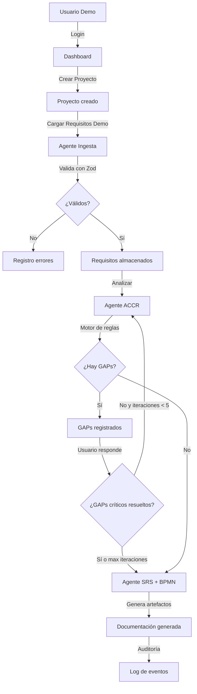

# Informe Final - CogniFlow MVP

## 1. Resumen ejecutivo

CogniFlow MVP es una prueba de concepto académica que demuestra cómo un sistema cognitivo puede asistir en la validación y refinamiento de requisitos de software (Análisis Funcional). El sistema ingesta requisitos estructurados en JSON, utiliza un motor de reglas (Agente ACCR) para detectar ambigüedades y faltantes (GAPs), itera con el usuario para resolverlos, y finalmente genera artefactos base como SRS, diagrama BPMN en Mermaid y una Matriz de Trazabilidad.

**Estado final:** `BUILD OK` — `npm run build` compila sin errores. Base de datos migrada y seed ejecutado. Flujo completo funcional.

## 2. Links del proyecto

- **Repositorio GitHub:** [Insertar Link a GitHub]
- **Demo público (Vercel/Render):** [Insertar Link a Demo]
- **Usuario demo:** `demo@cogniflow.app` / `Demo1234!`

## 3. Criterio de done — ✅ Verificado

| Criterio | Estado |
|---|---|
| Usuario demo puede loguearse | ✅ |
| Puede crear un proyecto | ✅ |
| Puede cargar requisitos demo | ✅ |
| El sistema detecta GAPs | ✅ |
| El usuario puede responder GAPs | ✅ |
| El sistema reanaliza tras respuesta | ✅ |
| Si no hay GAPs críticos, genera artefactos | ✅ |
| La auditoría registra eventos | ✅ |
| Build de producción compila sin errores | ✅ |

## 4. Arquitectura implementada

La arquitectura sigue un modelo monolítico basado en **Next.js 16 App Router**:

```
src/
├── app/
│   ├── actions/         # Server Actions (API Layer)
│   │   ├── auth.ts      # Login / Logout
│   │   └── project.ts   # CRUD proyectos + orquestación agentes
│   ├── dashboard/       # Vista de proyectos
│   ├── login/           # Autenticación demo
│   ├── projects/
│   │   ├── new/         # Crear proyecto
│   │   └── [id]/        # Detalle: GAPs, respuestas, artefactos
│   └── entrega-final/   # Resumen académico del MVP
├── lib/
│   ├── agents/
│   │   ├── auditAgent.ts    # Registro de auditoría
│   │   ├── memoryAgent.ts   # Persistencia de insights
│   │   ├── ingestAgent.ts   # Validación con Zod
│   │   ├── accrAgent.ts     # Detección de GAPs (motor de reglas)
│   │   ├── srsAgent.ts      # Generación SRS en Markdown
│   │   └── bpmnAgent.ts     # Diagrama BPMN en Mermaid
│   ├── auth.ts              # Sesión con cookies
│   └── db.ts                # Prisma singleton + adapter SQLite
└── proxy.ts                 # Middleware de protección de rutas
```

**Backend:** Server Actions en Next.js, orquestando 6 agentes especializados.  
**Persistencia:** SQLite local con Prisma ORM v7 (driver adapter `@prisma/adapter-better-sqlite3`).  
**Frontend:** React 19 + Tailwind CSS v4.

## 5. Diagrama de flujo del sistema



## 6. Stack tecnológico

| Tecnología | Versión | Rol |
|---|---|---|
| Next.js | 16.3.0 | Framework full-stack |
| React | 19.x | UI |
| TypeScript | 5.x | Tipos |
| Tailwind CSS | 4.x | Estilos |
| Prisma ORM | 7.9.1 | ORM + migraciones |
| SQLite (better-sqlite3) | — | Base de datos local |
| Zod | 4.x | Validación de esquemas |
| Mermaid.js | 11.x | Diagramas BPMN |
| React Markdown | 10.x | Renderizado de artefactos |
| bcryptjs | 3.x | Hash de contraseñas |

## 7. Agentes implementados

### Agente Ingesta (`ingestAgent`)
- Valida cada requisito contra un esquema Zod estricto.
- Detecta duplicados por `externalId` y `name`.
- Normaliza y almacena en base de datos.

### Agente ACCR (`accrAgent`)
- Motor de reglas basado en análisis de texto.
- Detecta GAPs de tipo: AMBIGUEDAD, FALTANTE, CONTRADICCION, INCOMPLETO.
- Clasifica severidad: CRITICAL / MEDIUM.
- Controla el límite de iteraciones (máx. 5).

### Agente SRS (`srsAgent`)
- Genera documento SRS en Markdown con secciones estándar.
- Incluye tabla de requisitos, criterios de aceptación y matriz de trazabilidad.

### Agente BPMN (`bpmnAgent`)
- Genera diagrama de flujo en sintaxis Mermaid.
- Renderizado en el navegador vía la librería Mermaid.js.

### Agente Auditoría (`auditAgent`)
- Registra cada acción relevante con timestamp, usuario y agente responsable.

### Agente Memoria (`memoryAgent`)
- Extrae y persiste insights (palabras clave) para contexto futuro.

## 8. Autoevaluación UX/UI — Heurísticas de Nielsen

| Heurística | Evaluación |
|---|---|
| **Visibilidad del estado** | Estado del proyecto visible (PENDING / GAPS_PENDING / COMPLETED / ESCALATED). Iteración actual siempre visible. |
| **Match con el mundo real** | Vocabulario de analista de sistemas: Requisitos, GAPs, SRS, BPMN. |
| **Control del usuario** | El usuario puede crear proyectos, cargar datos y responder GAPs de forma independiente. |
| **Prevención de errores** | Zod valida todos los inputs antes de persistir. Formularios con campos requeridos. |
| **Reconocimiento vs. recuerdo** | Navegación clara con botones de acción contextuales en cada etapa. |

## 9. Seguridad implementada

- **Contraseñas hasheadas** con `bcryptjs` (salt rounds = 10).
- **Rutas protegidas** con proxy/middleware Next.js — cualquier ruta que no sea `/login` requiere sesión.
- **Sin datos reales** — sólo datos sintéticos de demostración.
- **Sin exposición de secretos** — `SESSION_SECRET` definido en `.env` fuera del repositorio.
- **Fallback offline** — la app funciona sin `OPENAI_API_KEY`.

## 10. Uso de IA durante el desarrollo

- **Scaffolding y generación de código** mediante agente IA (Antigravity/Gemini/Claude).
- **Refactoring de componentes** React y Server Actions.
- **Debugging de errores de build** (Prisma v7 breaking changes, Zod v4 API changes, Next.js 16 proxy convention).
- **Generación de datos sintéticos** para seed de demostración.

## 11. Limitaciones conocidas

- El análisis recae principalmente en reglas estáticas en la versión base (sin `OPENAI_API_KEY`).
- No interpreta documentos Word/PDF — sólo ingesta JSON estructurado.
- El diagrama BPMN es una abstracción simple vía Mermaid (no estándar BPMN 2.0 completo).
- Sin autenticación multi-usuario real (sólo usuario demo).

## 12. Próximos pasos

- Integrar embeddings vectoriales (pgvector/Pinecone) para recuperación semántica de GAPs similares.
- Exportación de SRS en formato `.docx`.
- Notificaciones en tiempo real con Server-Sent Events.
- Integración con LLM (OpenAI GPT-4o / Gemini) con fallback a reglas.
- CI/CD con GitHub Actions + deploy automático a Vercel.