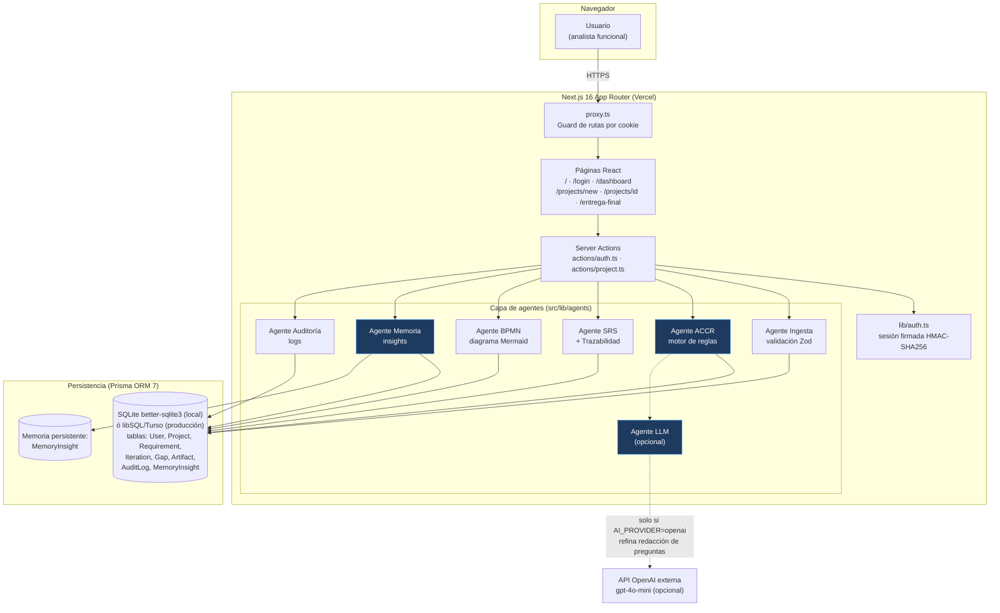
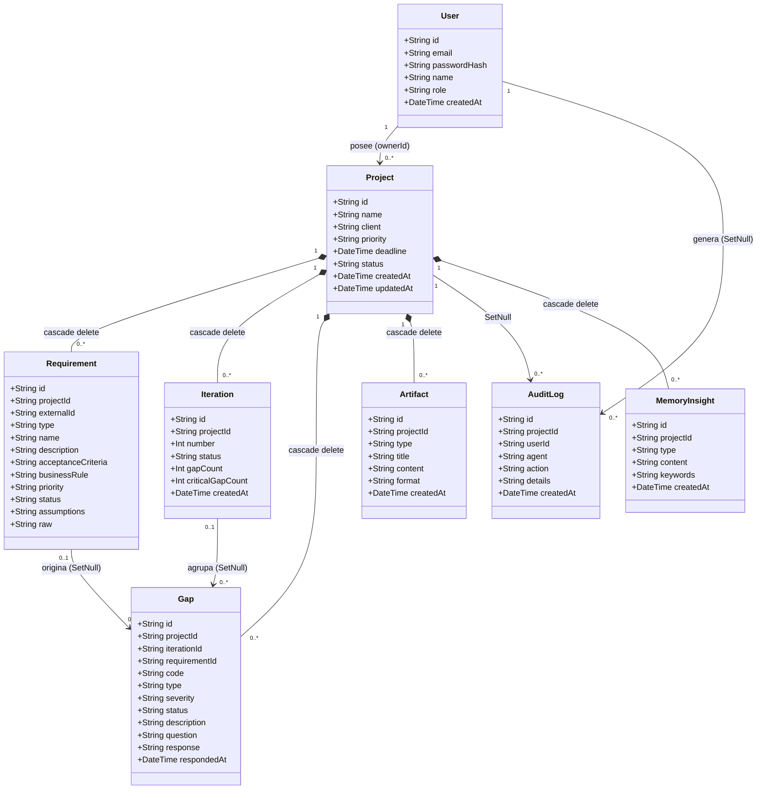
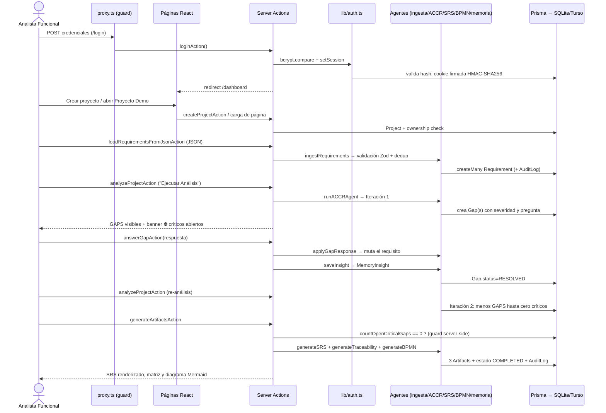

# Informe Técnico Final — CogniFlow

**Materia:** Inteligencia Artificial Aplicada a Organizaciones — UTN-FRBA
**Proyecto:** CogniFlow MVP — Sistema cognitivo para análisis funcional y detección de GAPS de calidad en requisitos
**Fecha:** Agosto 2026

---

## Accesos directos al proyecto

| Recurso | URL |
|---|---|
| Repositorio GitHub / GitLab | https://github.com/episergio/CogniFlow |
| Aplicación web en producción | https://cogniflow-ten.vercel.app |
| Video de demo | [COMPLETAR: URL del video] |
| Otro recurso publicado | [COMPLETAR: p. ej. repositorio de documentación, Figma, etc.] |

**Credenciales de usuario demo** (existentes en el seed, `prisma/seed.ts`):

| Campo | Valor |
|---|---|
| Email | `demo@cogniflow.app` |
| Password | `Demo1234!` |

La pantalla de login muestra estas credenciales en pantalla (`src/app/login/page.tsx:30-34`) porque es una cuenta académica de demostración con datos sintéticos.

---

## Sección 1 — Presentación del equipo y del proyecto

### 1.1 Integrantes y roles

| Integrante | Rol en el proyecto |
|---|---|
| [COMPLETAR] | [COMPLETAR: p. ej. Análisis funcional y redacción de reglas del Agente ACCR] |
| [COMPLETAR] | [COMPLETAR] |
| [COMPLETAR] | [COMPLETAR] |

### 1.2 Nombre del proyecto

**CogniFlow** (MVP). El nombre refleja la idea central: un *flujo cognitivo* donde el conocimiento sobre los requisitos se refina iterativamente entre un agente analizador y el analista humano.

### 1.3 Problema que resuelve

En proyectos de software, los requisitos levantados por analistas funcionales suelen llegar incompletos, ambiguos o sin reglas de negocio definidas. Estos defectos se propagan al desarrollo y se detectan tarde, cuando corregirlos es más caro. CogniFlow ataca ese problema con un ciclo asistido por IA:

1. **Ingesta** de requisitos estructurados (JSON validado con Zod).
2. **Detección automática de GAPS de calidad** (faltantes, ambigüedades, supuestos sin validar) mediante un motor de reglas —el *Agente ACCR*— que clasifica cada hallazgo con severidad CRITICAL / HIGH / MEDIUM.
3. **Ciclo de refinamiento iterativo**: cada GAP se presenta como una pregunta al usuario; su respuesta se aplica automáticamente al requisito correspondiente y se re-analiza en una nueva iteración (máximo 5, luego escala a revisión humana).
4. **Generación bloqueada mientras haya GAPS críticos**: la generación de artefactos está impedida en servidor, no solo oculta en la UI.
5. **Generación de artefactos documentales**: SRS en Markdown, Matriz de Trazabilidad requisito↔GAP↔respuesta y diagrama de flujo Mermaid renderizado en el navegador.

Fuente: `README.md`, `src/lib/agents/accrAgent.ts`, `src/lib/gapResolution.ts`.

### 1.4 Público objetivo

Derivado de la aplicación real (pantallas, vocabulario y flujo implementados):

- **Analistas funcionales / de sistemas**: usuarios principales. El dominio completo usa su vocabulario profesional (RF/RNF/RN/HU/SUP, criterios de aceptación, SRS, trazabilidad) y la carga admite sus tipos de requisito reales (`src/lib/agents/ingestAgent.ts:5-15`).
- **Líderes de proyecto / QA de requerimientos**: se benefician del dashboard con métricas por proyecto (total, GAPS pendientes, completados, promedio de iteraciones — `src/app/dashboard/page.tsx:16-19`) y de la auditoría exportable a CSV.
- **Clientes o expertos de negocio que responden clarificaciones**: rol secundario; responden las preguntas de los GAPS desde la misma pantalla de detalle del proyecto (`src/app/projects/[id]/page.tsx:148-161`).

---

## Sección 2 — Arquitectura técnica

CogniFlow es un monolito full-stack sobre **Next.js 16 (App Router)**: el frontend (React Server Components + componentes cliente), la capa de API (Server Actions) y los agentes viven en el mismo despliegue TypeScript. La persistencia es Prisma ORM sobre SQLite local (`better-sqlite3`) o base remota libSQL/Turso en producción.

### 2.1 Diagrama de arquitectura general



**Componentes IA vs lógica tradicional:**

- **IA real (LLM externo)**: únicamente `llmAgent.ts`, y es opcional. Si `AI_PROVIDER=openai` con key válida, refina la redacción de las preguntas de los GAPS (temperature 0.2, máx. 150 tokens, timeout 8 s). Ante cualquier error (red, cuota, timeout) cae en la pregunta base del motor de reglas: **el sistema nunca depende del LLM** (`src/lib/agents/llmAgent.ts`).
- **Inteligencia determinista (motor de reglas)**: el Agente ACCR decide qué GAPS existen, con qué severidad y cuándo escalar a humano. Es lógica tradicional auditable, no generativa.
- **Memoria persistente**: vive en la base de datos, tabla `MemoryInsight`, acotada por proyecto (`src/lib/agents/memoryAgent.ts`). Cada GAP resuelto genera un insight con palabras clave según tipo (`GAP_KEYWORDS` en `src/lib/gapResolution.ts:3-9`); las sugerencias se recuperan por coincidencia de keywords con los GAPS activos del contexto.
- **Auditoría transversal**: todo evento relevante pasa por `auditAgent.ts` → tabla `AuditLog`.

### 2.2 Diagrama de flujo de agentes (ciclo iterativo)

```mermaid
flowchart TD
    A(["Inicio: proyecto con requisitos"]) --> B["Agente Ingesta"]
    B --> B1{"¿Esquema Zod válido?<br/>¿Sin duplicados externalId/name?"}
    B1 -->|No| B2["Errores por fila devueltos a la UI"]
    B1 -->|Sí| B3["Requisitos persistidos"]

    B3 --> C{"¿Iteraciones >= MAX_ITERATIONS (5)?"}
    C -->|Sí| ESC["Estado ESCALATED<br/>Escala a revisión humana<br/>+ log de auditoría"]

    C -->|No| D["Agente ACCR crea Iteración N"]
    D --> E["Evalúa 6 reglas por requisito:<br/>COMPLETITUD·CRITICAL<br/>REGLA_NEGOCIO·CRITICAL<br/>AMBIGUEDAD·HIGH<br/>SUPUESTO·HIGH<br/>CLARIDAD·MEDIUM<br/>REGLA_NEGOCIO·MEDIUM"]
    E --> F{"¿Regla dispara?"}
    F -->|Sí y GAP no existía<br/>por (req, tipo)| G["Crea Gap GAP-IT{N}-{seq}<br/>pregunta refinada por LLM opcional"]
    F -->|No o ya manejado| H["Siguiente combinación"]
    G --> I{"¿Quedan GAPS críticos abiertos<br/>en TODO el proyecto?"}
    H --> I
    I -->|Sí| J["Estado GAPS_PENDING ⛔<br/>generación de artefactos<br/>bloqueada EN SERVIDOR"]
    J --> K["Usuario responde GAP<br/>(respuesta no vacía validada)"]
    K --> L["gapResolution aplica la respuesta<br/>al campo correcto del requisito:<br/>criterios · regla · descripción · supuesto"]
    L --> M["Agente Memoria guarda insight<br/>con keywords según tipo de GAP"]
    M --> D

    I -->|No| N["Estado READY_FOR_ARTIFACTS"]
    N --> O["Agente SRS: documento SRS Markdown"]
    N --> P["Agente SRS: Matriz de Trazabilidad<br/>requisito↔GAP↔pregunta↔respuestas"]
    N --> Q["Agente BPMN: diagrama Mermaid<br/>estado COMPLETED"]
    O & P & Q --> R["Agente Auditoría registra cada evento<br/>exportable a CSV"]
```

**Qué decide cada agente y cómo se comunican:**

- Los agentes no se llaman entre sí directamente: están **orquestados por las Server Actions** (`src/app/actions/project.ts`), que son el único punto de entrada autenticado. Cada agente expone funciones puras sobre la BD y deja rastro en auditoría.
- **Ingesta** decide qué entra al sistema (esquema estricto + deduplicación).
- **ACCR** decide qué es un defecto de calidad, su severidad, si corresponde nueva iteración y cuándo escalar a humano.
- **LLM** solo decide *cómo se redacta* la pregunta, nunca *qué* se pregunta ni *cuándo*.
- **Memoria** sugiere aprendizajes previos contextualizados; no modifica datos.
- La comunicación entre ciclo y usuario es la tabla `Gap`: el usuario responde, `applyGapResponse` muta el requisito, y la siguiente pasada del ACCR converge (un mismo GAP por par `(requirementId, type)` nunca se regenera — `accrAgent.ts:131-139`).

### 2.3 UML — Diagrama de clases (modelo de datos real)

Basado íntegramente en `prisma/schema.prisma`:



Estados de `Project.status` observados en código: `DRAFT` → `GAPS_PENDING` → `READY_FOR_ARTIFACTS` → `COMPLETED`; camino alternativo `ESCALATED` (`accrAgent.ts:106-118,189-194`, `bpmnAgent.ts:36-39`).

### 2.4 UML — Diagrama de secuencia del flujo principal

Login → proyecto → requisitos → GAPS → artefactos:



---

## Sección 3 — Stack tecnológico

| Componente | Tecnología / Herramienta | Por qué se eligió esta y no otra |
|---|---|---|
| Frontend | React 19 + Next.js 16 App Router + Tailwind CSS v4 | Un único lenguaje (TypeScript) para todo el stack evita mantener dos proyectos; Tailwind permite prototipar la UI oscura del dashboard en horas sin diseñar sistema de estilos propio. React era además lo ya conocido por el equipo [COMPLETAR: confirmar]. |
| Backend | Server Actions de Next.js + TypeScript 5 | Evita montar una API REST aparte: cada acción es una función tipada invocable desde formularios, con validación y ownership en el servidor. Menos superficie de ataque y menos código que Express/NestJS para un MVP. |
| Base de datos | SQLite vía `better-sqlite3` (local) / libSQL-Turso (producción), con Prisma ORM 7 | Cero infraestructura para la demo local (archivo `dev.db`); Turso da persistencia real gratis para el deploy público sin cambiar una línea de modelo: el adapter se resuelve en runtime según `DATABASE_URL` (`src/lib/db.ts:31-63`). Postgres habría sumado Docker/administración innecesaria para un MVP académico. |
| Modelo de IA | Motor de reglas determinista (Agente ACCR) + OpenAI `gpt-4o-mini` opcional vía REST directo | Para detección de GAPS se priorizó **auditoría y convergencia garantizada**: reglas explicables y testeables en vez de salidas probabilísticas. El LLM se limita a refinar redacción de preguntas (tarea donde un error no corrompe datos) con fallback automático; costo ~0 en modo default. |
| Orquestación | Server Actions como orquestador + patrón agente por archivo en `src/lib/agents/` | Sin frameworks de agentes (LangChain etc.): para 7 agentes especializados con flujo secuencial, un orquestador explícito es más simple, depurable y estable que una librería extra. |
| Despliegue | Vercel (serverless) + Turso | Deploy continuo desde GitHub sin servidores propios; Vercel soporta Next.js 16 nativamente. El bootstrap idempotente de esquema+seed (`dbBootstrap.ts`) resuelve la ausencia de migraciones previas en serverless. |
| Validación | Zod 4 | Esquemas declarativos compartibles entre ingesta y actions; mensajes de error por fila listos para mostrar en UI. |
| Renderizado de artefactos | Mermaid.js 11 (`securityLevel: strict`) + react-markdown 10 | Genera diagramas navegables sin backend de imágenes; `strict` neutraliza HTML/JS embebido en diagramas. |
| Autenticación | bcryptjs 3 + cookie firmada HMAC-SHA256 propia | Para un único rol demo, NextAuth era sobredimensionado; ~70 líneas auditables (`lib/auth.ts`) dan hash + cookie no falsificable. |

---

## Sección 4 — Evidencia de funcionamiento

### 4.1 Capturas obligatorias

No existen capturas dentro del repositorio (solo SVGs por defecto en `public/`). Checklist con las rutas exactas a capturar sobre la demo publicada (https://cogniflow-ten.vercel.app):

| # | Captura | Ruta exacta | Qué debe verse |
|---|---|---|---|
| 1 | Home / pantalla principal | `/` | Título CogniFlow, botones "Iniciar Sesión (Demo)", "Evidencia / Entrega Final", "GitHub" (`src/app/page.tsx`) |
| 2 | Login | `/login` | Caja azul con credenciales demo visibles |
| 3 | Dashboard | `/dashboard` | Métricas (Total, Con GAPS Pendientes, Completados, Promedio Iteraciones) y "Proyecto Demo CogniFlow" del seed |
| 4 | Flujo principal — requisitos | `/projects/project-demo-cogniflow` | Tabla de requisitos REQ-001…REQ-004 y formulario JSON precargado (`RequirementsLoader`) |
| 5 | Flujo principal — GAPS detectados | misma ruta tras "Ejecutar Análisis" | Tarjetas GAP-IT1-XX con badges CRITICAL/HIGH/MEDIUM y banner rojo ⛔ de bloqueo |
| 6 | **Output de la IA visible** | misma ruta tras responder GAPS críticos + re-analizar + "Generar Artefactos" | SRS en Markdown renderizado, Matriz de Trazabilidad y diagrama Mermaid dibujado en navegador |
| 7 | Memoria y auditoría | columna derecha de la misma ruta | Panel 🧠 Insights y timeline de Auditoría con botón Exportar CSV |

### 4.2 Guion de video demo (≤ 3 minutos)

Basado en el flujo real documentado en el README:

| Tiempo | Acción en pantalla | Narración sugerida |
|---|---|---|
| 0:00–0:20 | Home → Login con `demo@cogniflow.app` | "CogniFlow asiste al análisis funcional detectando GAPS de calidad en requisitos y generando la documentación base." |
| 0:20–0:40 | Dashboard → abrir Proyecto Demo CogniFlow | "El seed trae cuatro requisitos deliberadamente imperfectos." |
| 0:40–1:00 | Botón "Ejecutar Análisis" → aparecen GAPS con severidades | "El Agente ACCR aplica seis reglas: completitud, claridad, ambigüedad, reglas de negocio y supuestos." |
| 1:00–1:40 | Responder un GAP CRITICAL (ej. criterios de aceptación de REQ-001) → re-analizar → banner desaparece | "La respuesta se aplica al requisito y una nueva iteración verifica la corrección. Máximo cinco iteraciones, luego escala a humano." |
| 1:40–2:20 | "Generar Artefactos" → SRS, Matriz de Trazabilidad y diagrama Mermaid renderizado | "Sin GAPS críticos, el servidor habilita la generación de artefactos." |
| 2:20–2:50 | Panel de Insights + Auditoría → Exportar CSV | "Cada acción queda auditada y la memoria sugiere aprendizajes previos según el contexto." |
| 2:50–3:00 | Home con links al repo | Cierre. |

### 4.3 Log de sesión real (formato de auditoría)

La app audita todos los eventos en la tabla `AuditLog`. Formato exacto de export CSV generado por `src/app/api/projects/[id]/audit/export/route.ts`: cabecera `id;fecha;agente;accion;detalles;usuario`, UTF-8 con BOM, separador `;`.

Ejemplo representativo reconstruido con los literales exactos que produce el código (ids y timestamps de ejemplo; **el log definitivo debe capturarse ejecutando la app una vez** → pasos en Anexo 5): [COMPLETAR: pegar acá el CSV real descargado]

```csv
id;fecha;agente;accion;detalles;usuario
"cma1demo0001";"2026-08-21T12:00:00.000Z";"Sistema";"Login";"Usuario inició sesión";"demo@cogniflow.app"
"cma1demo0002";"2026-08-21T12:01:10.000Z";"IngestAgent";"Carga de requisitos";"Cargados 4 requisitos. Errores: 0";"demo@cogniflow.app"
"cma1demo0003";"2026-08-21T12:02:05.000Z";"ACCRAgent";"Detección de GAPS";"Iteración 1 finalizada. 5 GAPs nuevos (2 críticos). Críticos abiertos totales: 2.";"";"demo@cogniflow.app"
"cma1demo0004";"2026-08-21T12:04:30.000Z";"Usuario";"Respuesta a GAP";"GAP GAP-IT1-01 respondido y aplicado al requisito.";"demo@cogniflow.app"
"cma1demo0005";"2026-08-21T12:06:00.000Z";"SRSAgent";"Generación SRS";"Generado artefacto SRS (cma1demo0009)";"demo@cogniflow.app"
"cma1demo0006";"2026-08-21T12:06:02.000Z";"BPMNAgent";"Generación BPMN";"Generado artefacto BPMN (cma1demo0011)";"demo@cogniflow.app"
"cma1demo0007";"2026-08-21T12:07:15.000Z";"Sistema";"Export de auditoría";"Se exportaron 6 registros en CSV.";"demo@cogniflow.app"
```

Los textos de `accion` y `detalles` son literales del código: `accrAgent.ts:196-202`, `project.ts:55-61,194-200,221-227`, `srsAgent.ts:66-69`, `bpmnAgent.ts:41-44`, route de export línea 48-54.

### 4.4 Verificación automatizada incluida

El repositorio incluye `scripts/smoke-test.ts`, un test E2E contra base temporal que valida: ingesta válida/inválida/duplicada, detección de GAPS con críticos, guard de críticos abiertos, convergencia ≤5 iteraciones, aplicación de respuestas al requisito, generación de los 3 artefactos, estado COMPLETED, auditoría registrada y escalado a humano al agotar iteraciones.

```bash
DATABASE_URL=file:<ruta-absoluta-temporal> npx tsx scripts/smoke-test.ts
```

Resultado esperado por escenario: lista `PASS/FAIL` por check y cierre `SMOKE TEST OK`. [COMPLETAR: pegar salida de la corrida realizada]

---

## Sección 5 — Evaluación UX/UI

### 5.1 Heurísticas de Nielsen (resumen; tabla completa de 10 en Anexo 3)

| Heurística | Cumple? | Evidencia / Observación |
|---|---|---|
| Visibilidad del estado del sistema | Sí | Badge de estado siempre visible en header del proyecto (`projects/[id]/page.tsx:54-60`); contador "Iteración X/5" (`:230-244`); banner rojo ⛔ cuando hay críticos (`:126-131`). |
| Correspondencia con el mundo real | Sí | Vocabulario nativo del analista: RF/RNF/RN/HU/SUP, "criterios de aceptación", "Matriz de Trazabilidad", severidades CRITICAL/HIGH/MEDIUM. |
| Control y libertad del usuario | Sí | Link "← Volver" permanente, logout, respuesta individual de cada GAP sin pasos forzados, export libre de logs. |
| Prevención de errores | Sí | Validación Zod server-side en toda entrada; respuesta vacía rechazada en servidor (`project.ts:171-172`); dedup `externalId`/`name` antes de persistir; límite de 1 MB por payload (`project.ts:116-119`). |
| Reconocer antes que recordar | Parcial | El textarea JSON trae ejemplo precargado y documenta campos requeridos (`RequirementsLoader.tsx:36-52`); pero el usuario debe recordar ejecutar "Ejecutar Análisis" manualmente tras cargar requisitos. |
| Consistencia y estándares | Sí | Convención cromática consistente en todas las pantallas: verde=confirmar, azul=primario, rojo=crítico/bloqueo, ámbar=pendiente (dashboard, detalle, login). |
| Ayuda a los usuarios a reconocer errores | Sí | Errores de ingesta listados por fila con causa ("Fila 2: externalId duplicado") mostrados inline (`RequirementsLoader.tsx:71-77`). |
| Estética y minimalismo | Parcial | Pantalla de detalle concentra requisitos, GAPS, artefactos, memoria y logs en una vista de 3 columnas; densa aunque organizada. |
| Flexibilidad y eficiencia | Sí | Dos caminos de carga: botón demo de un clic o JSON propio; acciones clave accesibles desde el lugar de trabajo. |
| Ayuda y documentación | Parcial | Página `/entrega-final` resume el sistema, pero no hay ayuda contextual dentro del flujo operativo. |

### 5.2 Evaluación orientada al público objetivo

**1. ¿El diseño es apropiado para el nivel técnico del usuario final?**
Sí para el usuario principal (analista funcional). El flujo exige comprender qué es un requisito bien escrito y operar un textarea JSON: barrera razonable para ese perfil, y mitigada con la carga demo de un clic y el ejemplo precargado. Para el cliente que solo responde GAPS, la interacción se reduce a leer una pregunta y escribir texto en un input, lo que también es apropiado.

**2. ¿El lenguaje visual y textual es comprensible para ese usuario?**
El léxico coincide exactamente con el dominio profesional (GAP, severidad, trazabilidad, SRS): no requiere traducción mental. Los estados del proyecto (`GAPS_PENDING`, `READY_FOR_ARTIFACTS`, `ESCALATED`) están en inglés técnico; un analista los interpreta sin fricción, aunque podría mejorarse con tooltips. Los mensajes de bloqueo explican causa y acción concreta ("Respondelos y reanalizá antes de generar artefactos").

**3. ¿Se hizo alguna prueba con usuario real?**
[COMPLETAR: feedback de la prueba — quién probó, qué tareas realizó, qué falló, qué se ajustó]

---

## Sección 6 — Evaluación de ciberseguridad

Fundamentos verificados en el código: `src/lib/auth.ts`, `src/proxy.ts`, `src/app/actions/*`, `.gitignore`, `.env.example`.

| Riesgo identificado | Tipo | Medida implementada o decisión tomada |
|---|---|---|
| Falsificación de sesión / escalación horizontal (acceso a proyectos ajenos) | OWASP A01 – Broken Access Control | Cookie de sesión `httpOnly`, `sameSite=lax`, `secure` en producción y **firmada HMAC-SHA256** con `SESSION_SECRET`; comparación con `timingSafeEqual` (no vulnerable a timing attacks) — `auth.ts:14-46`. Además, **cada** Server Action y el route handler de export verifican sesión + ownership (`getOwnedProject`, `project.ts:21-26`; 401/404 en `route.ts:13-23`), y `proxy.ts` bloquea rutas privadas sin cookie. |
| Robo de credenciales / enumeración de usuarios | OWASP A07 – Identificación y autenticación | Contraseñas hasheadas con bcryptjs salt 10 (`seed.ts:12`, `dbBootstrap.ts:130`); login devuelve genérico "Credenciales inválidas" tanto si no existe el email como si el hash no coincide (`actions/auth.ts:29-37`): no se filtra qué dato falló. |
| Inyección SQL / XSS vía contenido de requisitos o GAPS | OWASP A03 – Injection | Todas las consultas pasan por Prisma (queries parametrizadas); React escapa el contenido por defecto al renderizar; Mermaid se inicializa con `securityLevel:"strict"` (`MermaidDiagram.tsx:18`); los textos insertados en tablas Markdown se sanitizan quitando `\|` y saltos de línea (`gapResolution.ts:11-13`, `srsAgent.ts:85-87`); el CSV exporta valores escapados con comillas dobles (`route.ts:5-7`). |
| Filtración de secretos en el repositorio | Privacidad / fuga de claves | `.gitignore` excluye `.env*`, `*.db`, `*.db-journal/wal/shm` y `/src/generated/prisma`; no hay claves hardcodeadas (verificado: la única cadena sensible es el fallback de desarrollo `SESSION_SECRET || "cogniflow-dev-secret-not-for-production"` — decisión tomada: es un valor de dev documentado como tal y en producción se define `SESSION_SECRET` obligatoria en variables de entorno de Vercel, README §Seguridad). |
| Denegación de servicio por payloads enormes o abuso del LLM | OWASP A04 / disponibilidad | Límite de tamaño del JSON de requisitos configurable `MAX_FILE_SIZE_MB=1` en servidor (`project.ts:116-119`); llamada al LLM con `AbortSignal.timeout(8000)` y `max_tokens:150` (`llmAgent.ts:2,43`); ante cualquier error cae en modo reglas sin degradar la app. |
| Exposición de datos sensibles a terceros (proveedor de IA) | Privacidad | Datos de la demo son sintéticos; el envío de contenido a OpenAI está apagado por defecto (`AI_PROVIDER=rules`) y, si se activa, solo viaja el texto del requisito para reformular una pregunta — decisión documentada en README §Stack/variables. |
| Pérdida de integridad del proceso (artefactos prematuros) | Integridad de negocio | Regla dura en servidor: `generateArtifactsAction` recuenta GAPS críticos abiertos y rechaza la operación incluso si se manipula la UI (`project.ts:218-233`), dejando log del intento. |

---

## Sección 7 — IAs usadas en el co-work de desarrollo

| Herramienta IA | Para qué la usaron | Aportó bien / mal / sorprendió |
|---|---|---|
| opencode (agente CLI) | [COMPLETAR — ej.: scaffolding de Server Actions y agentes, refactors guiados] | [COMPLETAR — ej.: aportó bien en boilerplate; sorprendió resolviendo breaking changes de Prisma 7/Zod 4] |
| Antigravity | [COMPLETAR] | [COMPLETAR] |
| Claude | [COMPLETAR — ej.: revisión de diseño de reglas ACCR y redacción de docs] | [COMPLETAR] |
| ChatGPT | [COMPLETAR — ej.: generación de datos sintéticos del seed, debugging puntual] | [COMPLETAR] |
| Copilot | [COMPLETAR — ej.: autocomplete en TSX] | [COMPLETAR] |

**Reflexión sobre el co-work (borrador editable):**
Lo que hubiera sido imposible o el doble de lento sin IA fue, principalmente, sostener tres versiones mayores simultáneas de toolchain en un MVP corto: Next.js 16 (convención `proxy.ts`), Prisma 7 (driver adapters y cliente generado) y Zod 4 cambiaron APIs respecto de todo material de entrenamiento clásico, y los agentes permitieron diagnosticar y corregir esos errores de build en minutos en lugar de días de lectura de changelogs. También aceleró la generación del smoke test E2E y de los datos sintéticos deliberadamente imperfectos del seed. Lo que la IA hizo mal y hubo que corregir: propuso patrones de versiones anteriores (middleware en vez de proxy, `@prisma/client` sin adapter, schemas de Zod v3), tendió a sobre-generar código defensivo que ensuciaba el diff, y en más de una ocasión dio por hecho comportamientos del framework que había que verificar contra la documentación real instalada en `node_modules/next/dist/docs`. [EDITAR: ajustar con casos concretos del equipo]

---

# PARTE 2 — IA local en el proyecto

### 1. ¿Qué papel jugaría un LLM/SLM local?

Jugaría el rol de **componente de soporte / subagente**, no agente principal: exactamente el hueco que hoy ocupa `llmAgent.ts`. Su diseño actual (función `enrichGapQuestion` con fallback total a reglas) hace el reemplazo trivial: bastaría cambiar la llamada `fetch` a `https://api.openai.com/v1/chat/completions` por un endpoint local (Ollama, llama.cpp) exponiendo la misma interfaz, manteniendo el timeout y el fallback. Hoy esa tarea depende de una API cloud paga y externa; con un SLM local pasaría a ser gratuita, offline y con latencia predecible. Además habilitaría algo que hoy está fuera de alcance por privacidad: enviar a un LLM el texto completo de requisitos de clientes reales, algo que muchas organizaciones prohíben hacer hacia APIs de terceros. El motor de reglas ACCR seguiría decidiendo *qué* es un defecto: la determinismo y auditabilidad de esa decisión no deberían delegarse en un modelo probabilístico.

### 2. ¿Qué le aportaría al usuario?

Tres cosas concretas. **Privacidad y confianza**: los requisitos —frecuentemente propiedad intelectual del cliente— jamás salirían de la organización, eliminando la fricción de aprobar el uso de un proveedor externo. **Costo cero marginal**: hoy cada refinamiento opcional consume tokens facturables; en local, ilimitado. **Disponibilidad**: funcionaría detrás de firewalls corporativos o sin internet (una situación real en workshops con clientes), cosa que hoy degrada silenciosamente al modo reglas. Y abre posibilidades nuevas: sugerir borradores de respuesta para los GAPS (hoy el usuario escribe desde cero) usando modelos locales sin riesgo de fuga.

### 3. ¿Qué aportaría al profesional?

Al analista funcional le habilitaría trabajo **sobre datos que no pueden salir de la organización**: analizar históricos de `AuditLog` y `Gap` para descubrir patrones recurrentes de calidad de requisitos (qué tipo de GAP aparece más por tipo de proyecto, qué palabras ambiguas repite el negocio), algo valioso para madurar plantillas de levantamiento. También análisis offline en sitio con el cliente, y clasificación semántica de requisitos similares entre proyectos (hoy `getSuggestions` solo hace matching literal de keywords — `memoryAgent.ts:32-34`; embeddings locales permitirían memoria semántica sin enviar nada afuera).

### 4. ¿Qué limitaciones concretas tiene versus una API cloud?

**Hardware**: un modelo útil para español técnico requiere GPU con VRAM considerable o RAM alta para inferencia cuantizada; una laptop promedio corre SLMs de 3–8B con calidad inferior a `gpt-4o-mini` en redacción fina. **Calidad**: los modelos pequeños tienden a alucinar o dar respuestas genéricas justamente en la tarea delicada (formular preguntas precisas sobre requisitos). **Mantenimiento y actualización**: la organización debe gestionar versiones, parches de seguridad y evaluación de nuevos modelos; la API cloud lo resuelve el proveedor. **Contexto**: ventanas de contexto menores limitan análisis de proyectos con decenas de requisitos largos. **Infraestructura**: en el despliegue actual (Vercel serverless) es directamente inviable: exigiría un servidor propio u otra plataforma, cambiando el modelo de deploy gratuito actual.

### Evidencia con Ollama (opcional)

[COMPLETAR: si se realiza la prueba — modelo usado (p. ej. llama3.1:8b / qwen2.5:7b), hardware, prompt enviado, respuesta comparada con la pregunta base de reglas, latencia medida, y captura de pantalla]

---

## Conclusiones

### Qué se logró implementar

- Ciclo completo y convergente: ingesta validada → detección de GAPS con severidades → refinamiento interactivo que muta los requisitos → convergencia a cero críticos en ≤5 iteraciones con escala automática a humano (`scripts/smoke-test.ts` verifica este comportamiento extremo a extremo).
- Guardia de integridad server-side: los artefactos no se generan con GAPS críticos abiertos, independiente de la UI.
- Generación de los tres artefactos del análisis funcional: SRS Markdown, Matriz de Trazabilidad requisito↔GAP↔respuesta y diagrama Mermaid renderizado con sandboxing.
- Arquitectura agéntica simple y auditable: 7 especialistas orquestados por Server Actions, con auditoría completa exportable a CSV y memoria de insights por proyecto.
- Seguridad real para un MVP: sesiones firmadas no falsificables, bcrypt, ownership en cada acción, secretos fuera del repo.
- Publicación en producción con persistencia remota (Vercel + Turso) y bootstrap idempotente apto para serverless.

### Qué quedó fuera del MVP

- Ingesta de documentos (Word/PDF): solo JSON estructurado.
- BPMN 2.0 estándar: el diagrama es una abstracción flowchart Mermaid genérica.
- Memoria semántica (embeddings/vectorial): hoy es keyword-matching acotado al proyecto.
- Tests unitarios formales y CI: existe smoke test manual pero no pipeline.
- Multiusuario real con roles y registro abierto: solo usuario demo.

### Próximos pasos

1. Reemplazo del keyword-matching por recuperación semántica con embeddings (posiblemente locales).
2. Exportación del SRS a `.docx`.
3. CI con GitHub Actions corriendo el smoke test en cada PR.
4. Prueba de LLM local (Ollama) como subagente de redacción, midiendo calidad vs `gpt-4o-mini`.
5. Pruebas con usuarios reales (analistas) y ajuste de UX según hallazgos.

---

*Informe generado sobre evidencia verificable en el código fuente del repositorio. Todo dato no verificable está marcado [COMPLETAR].*
