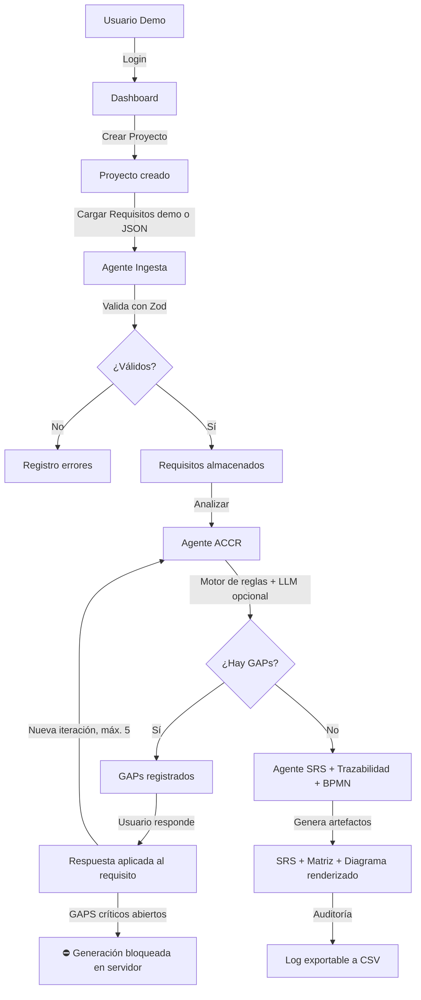

# Informe Final - CogniFlow MVP

## 1. Resumen ejecutivo

CogniFlow MVP es una prueba de concepto académica que demuestra cómo un sistema cognitivo puede asistir en la validación y refinamiento de requisitos de software (Análisis Funcional). El sistema ingesta requisitos estructurados en JSON, utiliza un motor de reglas (Agente ACCR) para detectar ambigüedades y faltantes (GAPs), itera con el usuario para resolverlos —aplicando cada respuesta al requisito correspondiente— y finalmente genera artefactos base: SRS en Markdown, Matriz de Trazabilidad y diagrama de flujo Mermaid renderizado en el navegador.

**Estado:** flujo completo funcional y convergente. La generación de artefactos permanece bloqueada en servidor mientras existan GAPS críticos abiertos.

**Demo pública:** [https://cogniflow-ten.vercel.app](https://cogniflow-ten.vercel.app)

## 2. Links del proyecto

- **Repositorio GitHub:** [https://github.com/episergio/CogniFlow](https://github.com/episergio/CogniFlow)
- **Demo público (Vercel):** [https://cogniflow-ten.vercel.app](https://cogniflow-ten.vercel.app)
- **Usuario demo:** `demo@cogniflow.app` / `Demo1234!`

## 3. Criterio de done — ✅ Verificado

| Criterio | Estado |
|---|---|
| Usuario demo puede loguearse | ✅ |
| Puede crear un proyecto | ✅ |
| Puede cargar requisitos demo o propios (JSON validado con Zod) | ✅ |
| El sistema detecta GAPs con severidad | ✅ |
| El usuario puede responder GAPs y la respuesta se aplica al requisito | ✅ |
| El sistema reanaliza en una nueva iteración (máx. 5, luego escala a humano) | ✅ |
| GAPS críticos abiertos bloquean la generación de artefactos en servidor | ✅ |
| Sin GAPS críticos genera SRS, Matriz de Trazabilidad y Diagrama Mermaid | ✅ |
| Mermaid se renderiza en el navegador (securityLevel strict) | ✅ |
| Auditoría registra eventos y permite exportarlos a CSV | ✅ |
| Sesión firmada con HMAC-SHA256 (cookie no falsificable) | ✅ |
| Funciona sin OPENAI_API_KEY (motor de reglas); LLM opcional con fallback | ✅ |
| Build de producción compila sin errores | ✅ |

## 4. Arquitectura implementada

La arquitectura sigue un modelo monolítico basado en **Next.js 16 App Router**:

```
src/
├── app/
│   ├── actions/         # Server Actions (API Layer)
│   │   ├── auth.ts      # Login / Logout
│   │   └── project.ts   # CRUD proyectos + orquestación agentes
│   ├── api/projects/[id]/audit/export/  # Export CSV de auditoría
│   ├── dashboard/       # Vista de proyectos
│   ├── login/           # Autenticación demo
│   ├── projects/
│   │   ├── new/         # Crear proyecto
│   │   └── [id]/        # Detalle: GAPs, respuestas, artefactos
│   └── entrega-final/   # Resumen académico del MVP
├── components/
│   ├── MermaidDiagram.tsx      # Render cliente de diagramas
│   └── RequirementsLoader.tsx  # Carga de JSON propio
├── lib/
│   ├── agents/
│   │   ├── auditAgent.ts    # Registro de auditoría
│   │   ├── memoryAgent.ts   # Persistencia de insights (por proyecto)
│   │   ├── ingestAgent.ts   # Validación con Zod
│   │   ├── accrAgent.ts     # Detección de GAPs (motor de reglas)
│   │   ├── llmAgent.ts      # LLM opcional con fallback a reglas
│   │   ├── srsAgent.ts      # SRS Markdown + Matriz de Trazabilidad
│   │   └── bpmnAgent.ts     # Diagrama de flujo Mermaid
│   ├── gapResolution.ts     # Aplicación de respuestas al requisito + guard críticos
│   ├── auth.ts              # Sesión firmada (HMAC-SHA256)
│   └── db.ts                # Prisma singleton + adapter SQLite
└── proxy.ts                 # Proxy de protección de rutas (Next.js 16)
```

**Backend:** Server Actions en Next.js, orquestando agentes especializados.
**Persistencia:** SQLite local con Prisma ORM v7 (driver adapter `@prisma/adapter-better-sqlite3`).
**Frontend:** React 19 + Tailwind CSS v4.

## 5. Diagrama de flujo del sistema



## 6. Stack tecnológico

| Tecnología | Versión | Rol |
|---|---|---|
| Next.js | 16.3.0 | Framework full-stack |
| React | 19.x | UI |
| TypeScript | 5.x | Tipos |
| Tailwind CSS | 4.x | Estilos |
| Prisma ORM | 7.9.1 | ORM + migraciones |
| SQLite (better-sqlite3) | — | Base de datos local |
| Zod | 4.x | Validación de esquemas |
| Mermaid.js | 11.x | Diagramas renderizados en navegador |
| React Markdown | 10.x | Renderizado de artefactos |
| bcryptjs | 3.x | Hash de contraseñas |

## 7. Agentes implementados

### Agente Ingesta (`ingestAgent`)
- Valida cada requisito contra un esquema Zod estricto.
- Detecta duplicados por `externalId` y `name`.
- Normaliza y almacena en base de datos.

### Agente ACCR (`accrAgent`)
- Motor de reglas basado en análisis de texto.
- Detecta GAPs de tipo: COMPLETITUD, CLARIDAD, AMBIGUEDAD, REGLA_NEGOCIO, SUPUESTO.
- Clasifica severidad: CRITICAL / HIGH / MEDIUM.
- Un mismo GAP por (requisito, tipo): no regenera GAPS ya respondidos, garantizando la convergencia de las iteraciones.
- Controla el límite de iteraciones (`MAX_ITERATIONS`, default 5) y escala a revisión humana.
- Si `AI_PROVIDER=openai` con key válida, el LLM solo refina la redacción de preguntas; ante cualquier error cae en la pregunta base del motor de reglas.

### Agente SRS (`srsAgent`)
- Genera documento SRS en Markdown con secciones estándar.
- Genera la **Matriz de Trazabilidad**: requisito ↔ GAP ↔ pregunta ↔ respuesta ↔ estado.

### Agente BPMN (`bpmnAgent`)
- Genera diagrama de flujo en sintaxis Mermaid.
- Renderizado en el navegador vía componente cliente con `securityLevel: "strict"`.

### Agente Auditoría (`auditAgent`)
- Registra cada acción relevante con timestamp, usuario y agente responsable.
- Exportación a CSV desde la vista de proyecto (route handler con control de sesión y ownership).

### Agente Memoria (`memoryAgent`)
- Extrae y persiste insights por proyecto según el tipo de GAP resuelto.
- Sugiere aprendizajes previos según el contexto de GAPS activos.

## 8. Autoevaluación UX/UI — Heurísticas de Nielsen

| Heurística | Evaluación |
|---|---|
| **Visibilidad del estado** | Estado del proyecto visible (DRAFT / GAPS_PENDING / READY_FOR_ARTIFACTS / COMPLETED / ESCALATED). Iteración actual siempre visible. Banner explícito cuando la generación está bloqueada. |
| **Match con el mundo real** | Vocabulario de analista de sistemas: Requisitos, GAPs, SRS, Trazabilidad, BPMN. |
| **Control del usuario** | El usuario puede crear proyectos, cargar datos propios, responder GAPs y exportar logs de forma independiente. |
| **Prevención de errores** | Zod valida todos los inputs antes de persistir. La respuesta vacía a un GAP se rechaza en servidor. |
| **Reconocimiento vs. recuerdo** | Navegación clara con botones de acción contextuales en cada etapa. |

## 9. Seguridad implementada

- **Contraseñas hasheadas** con `bcryptjs` (salt rounds = 10).
- **Sesión firmada**: cookie `httpOnly` con userId + HMAC-SHA256 (`SESSION_SECRET`), comparación en tiempo constante; no puede falsificarse.
- **Rutas protegidas** con proxy Next.js 16 + verificación de sesión y ownership en cada Server Action y route handler.
- **Bloqueo server-side de artefactos** con GAPS críticos abiertos (no depende de la UI).
- **Mermaid sandboxed** con `securityLevel: "strict"`.
- **Sin datos reales** — sólo datos sintéticos de demostración.
- **Sin exposición de secretos** — `.env*` y `*.db` fuera del repositorio.
- **Fallback offline** — la app funciona sin `OPENAI_API_KEY`; el LLM es opcional.

## 10. Uso de IA durante el desarrollo

- **Scaffolding y generación de código** mediante agente IA.
- **Refactoring de componentes** React y Server Actions.
- **Debugging de errores de build** (Prisma v7 breaking changes, Zod v4 API changes, Next.js 16 proxy convention).
- **Generación de datos sintéticos** para seed de demostración.

## 11. Limitaciones conocidas

- El análisis recae principalmente en reglas estáticas en la versión base (sin `OPENAI_API_KEY`); el LLM opcional solo refina redacción, no decide.
- No interpreta documentos Word/PDF — sólo ingesta JSON estructurado.
- El diagrama es una abstracción simple vía Mermaid (no BPMN 2.0 estándar) y es genérico para todos los proyectos.
- Un GAP por (requisito, tipo): si el usuario resuelve y luego reintroduce el mismo problema, no se vuelve a marcar.
- SQLite en archivo: para deploys serverless hay que migrar a BD administrada (ver README).

## 12. Próximos pasos

- Integrar embeddings vectoriales (pgvector/Pinecone) para recuperación semántica de GAPs similares.
- Exportación de SRS en formato `.docx`.
- Notificaciones en tiempo real con Server-Sent Events.
- Tests automatizados del motor de reglas + CI con GitHub Actions.
- Deploy automático a plataforma con BD persistente.
